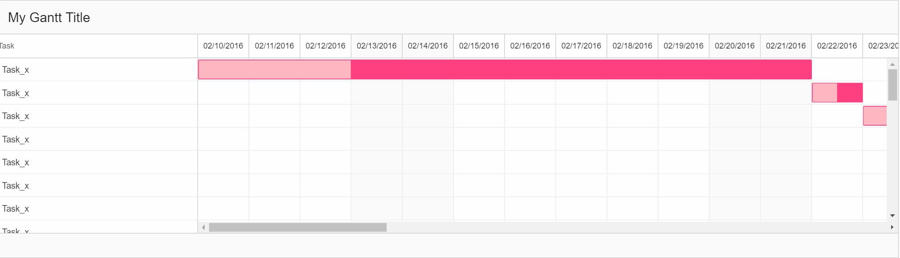

# Angular2-gantt v0.0.1

Work in progress!

## Description
A simple Angular2 Gantt component. Uses "2.1.0" of Angular2.
This project was generated with [angular-cli](https://github.com/angular/angular-cli) version 1.0.0-beta.18.

## Getting Started
1. Fork and clone this repo
2. npm install
3. ng serve

## Installation

To install this component to an external project:
TBA

## Usage
TBA

## Demo

## Compatibility (tested with)
* Firefox (latest)
* Chromium (latest)
* IE (latest)

## License
* License: MIT
