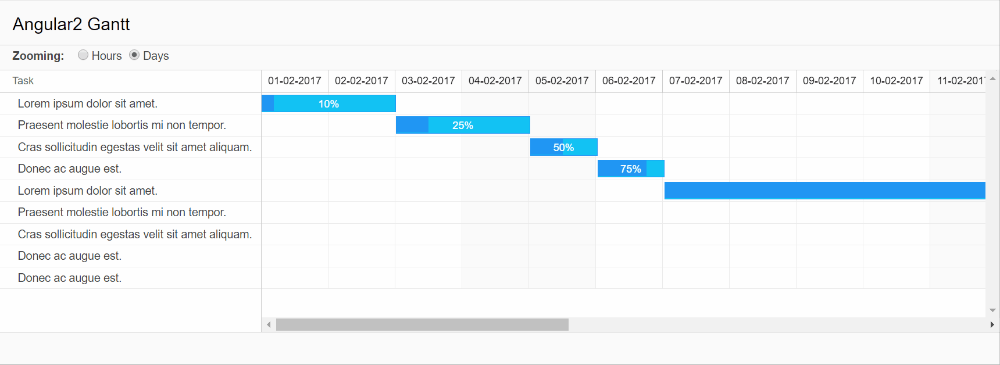

# Angular 2 Gantt 

This is the home for the Angular 2 gantt component. This project was generated with [angular-cli](https://github.com/angular/angular-cli) version 1.0.0-beta.18.

The aim of this project is to make a material design angular 2 gantt component.

### Getting Started
1. git clone https://github.com/dalestone/angular2-gantt.git
2. npm install -g angular-cli
2. npm install
3. npm start

### Project status
Angular 2 gantt is currently in alpha and under active development.
During alpha, breaking API and behaviour changes will be occuring regularly.

## Demo

## Browser support
Angular 2 Gantt supports the most recent versions of major browsers: Chrome (including Android), Firefox, Safari (including iOS), and IE11 / Edge.
